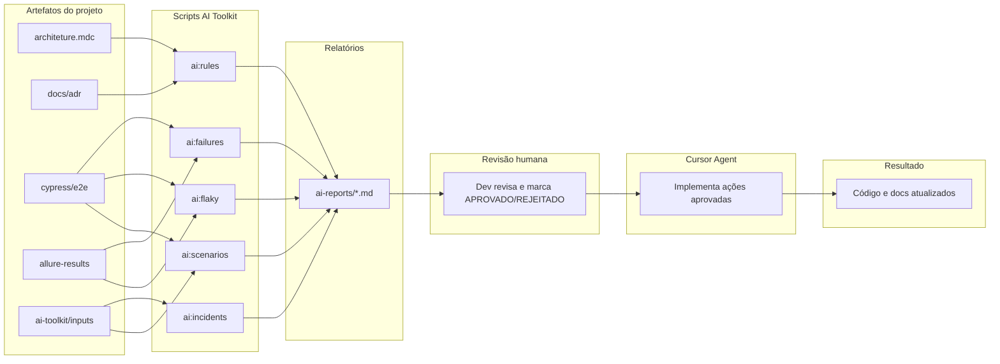
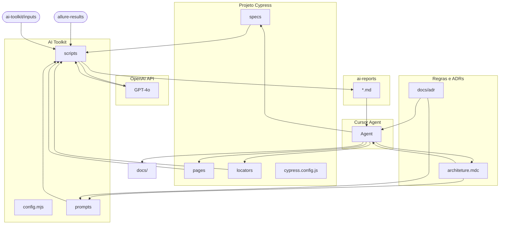

# Ecossistema AI Toolkit e Melhoria Contínua

**Versão:** 1.0  
**Status:** Ativo

Este documento explica como todo o ecossistema de melhoria contínua da automação funciona, como as partes se integram, o fluxo já realizado de implementação e como utilizar na prática (uso da IA e uso no Cursor-ready), com exemplos e passo a passo detalhado.

---

## 1. Visão geral do ecossistema

O ecossistema é formado por quatro pilares que trabalham juntos:

1. **Projeto de automação Cypress** – specs, Page Objects, locators, configuração e testes do Softcomshop.
2. **Regras e documentação** – `.cursor/rules/architeture.mdc`, ADRs em `docs/adr/`, guias em `docs/referencias/`. São a fonte de verdade que a IA lê e que o Cursor segue ao implementar.
3. **AI Toolkit** – scripts Node.js (AI SDK + OpenAI) que rodam fora do Cypress, leem artefatos do projeto e geram relatórios com análise e ações acionáveis.
4. **Cursor (Agent mode)** – executor das ações aprovadas pelo desenvolvedor após revisão dos relatórios.

**Objetivo:** Melhoria contínua da automação com **validação humana** e **execução assistida pelo Cursor**: regras mais consistentes, cenários de teste gerados a partir de regras de negócio e detecção/correção de testes flaky e anti-padrões.

---

## 2. Diagrama do fluxo de uso



O pipeline em três etapas:

1. **Gerar** – Você roda um dos scripts (`npm run ai:rules`, `ai:scenarios`, `ai:flaky`, `ai:failures` ou `ai:incidents`). O script lê os artefatos do projeto, chama a OpenAI e grava um relatório em `ai-reports/`.
2. **Validar** – Você abre o relatório, lê a análise e a seção "Ações Cursor-ready". Marca como `[APROVADO]` ou `[REJEITADO]` as ações que deseja (ou não) que o Cursor execute.
3. **Planejar e Executar** – Você copia a seção Cursor-ready e cola no chat do Cursor em **modo Plan**, com a instrução gerada no relatório (que inclui a referência `@` ao arquivo). O Cursor gera um plano de ação. Após revisar, você muda para o **modo Agent** e pede para executar. O Cursor edita/cria os arquivos conforme as ações aprovadas.

---

## 3. Componentes do ecossistema

### Regras e documentação

- **architeture.mdc** – Regras do projeto (Cursor), anti-padrões, padrões de teste, comandos de login, documentação obrigatória.
- **docs/adr/** – Architecture Decision Records (ADR-0002 a ADR-0017). Decisões que o AI Toolkit usa para gerar sugestões alinhadas ao projeto.
- **docs/referencias/** – Guias (decisões rápidas, checklist de validação, aprendizagens e lições, etc.).

São a **fonte de verdade**: o AI Toolkit lê esses arquivos para montar o contexto enviado à IA, e o Cursor segue as mesmas regras ao implementar.

### AI Toolkit

- **Onde fica:** pasta `ai-toolkit/` na raiz do projeto (config.mjs, utils.mjs, cursor-ready.mjs, prompts/, analyze-rules.mjs, generate-scenarios.mjs, detect-flaky.mjs, analyze-failures.mjs, analyze-incidents.mjs).
- **O que faz cada script:**
  - **ai:rules** – Analisa architeture.mdc, ADRs e guias; gera redundâncias, gaps, conflitos e melhorias; produz ações Cursor-ready para consolidar ou criar regras.
  - **ai:scenarios** – Recebe um arquivo de regras de negócio em `ai-toolkit/inputs/`; gera cenários de teste e ações Cursor-ready (explorar tela, criar spec, Page Object, locators, documentação).
  - **ai:flaky** – Lê `allure-results/` e código dos specs; identifica candidatos a flaky, gargalos e anti-padrões; gera correções com código atual e sugerido.
  - **ai:failures** – Lê `allure-results/` e código dos specs que falharam; classifica se o erro é um "Bug na Aplicação" ou um "Erro no Teste"; gera ações Cursor-ready apenas para os erros no teste.
  - **ai:incidents** – Lê arquivos JSON de incidentes (bugs corrigidos) em `ai-toolkit/inputs/incidents/`; gera cenários de teste de regressão e ações Cursor-ready para automatizá-los.
- **Relatórios:** gerados em `ai-reports/` (rules-analysis.md, scenarios-&lt;nome&gt;.md, flaky-analysis.md, failures-analysis.md, incidents-analysis.md).
- **Pré-requisito:** arquivo `.env` na raiz com `OPENAI_API_KEY` (copiar de `.env.example`).

Detalhes de uso, estrutura de pastas e troubleshooting: [ai-toolkit/README.md](../../ai-toolkit/README.md).

### Cursor Agent

- **Papel:** Executor das ações aprovadas. Ele lê a seção "Ações Cursor-ready" colada no chat, ignora ações `[REJEITADO]` e aplica as `[APROVADO]` (editar/criar arquivos conforme "O que fazer" e "Código sugerido" quando houver).
- **Como usar:** Copiar a seção Cursor-ready do relatório, colar no chat do Cursor em **modo Plan** (para gerar um checklist seguro) e enviar com a instrução gerada no relatório, que será parecida com: *"Implemente as ações aprovadas abaixo. Antes de codificar, leia a análise completa e o contexto no arquivo @[nome-do-relatorio].md..."*. Depois, mudar para **modo Agent** para executar.

### Relatórios Cursor-ready

Cada relatório tem duas partes:

- **Parte 1 – Análise:** resumo, listas/tabelas (redundâncias, cenários, flaky, etc.) para leitura humana.
- **Parte 2 – Ações Cursor-ready:** bloco em markdown com instruções e uma ou mais ações no formato:
  - `### [APROVADO] Ação N: Título`
  - **Tipo:** editar-arquivo | criar-arquivo | explorar-tela
  - **Arquivo(s):** caminho do arquivo
  - **O que fazer:** descrição clara e acionável
  - **Contexto:** justificativa ou referência
  - **Código sugerido** ou **Estrutura sugerida** (quando aplicável), em bloco de código

O desenvolvedor altera `[APROVADO]` para `[REJEITADO]` nas ações que não deseja executar antes de colar no Cursor.

---

## 4. Como todas as partes se integram



A integração é fechada:

- As **regras** que o Cursor segue ao implementar são as mesmas que o AI Toolkit usa para gerar sugestões (architeture.mdc e ADRs alimentam os prompts).
- Os **relatórios** produzidos pelo toolkit são feitos para serem consumidos pelo Cursor (formato Cursor-ready com Tipo, Arquivo, O que fazer, Código sugerido).
- **Nenhum script altera código sozinho** – sempre há revisão humana (você aprova ou rejeita cada ação antes de colar no Agent).
- **allure-results** alimenta o ai:flaky; **ai-toolkit/inputs** (arquivos de regras de negócio) alimentam o ai:scenarios.

---

## 5. Fluxo já realizado (implementação)

O ecossistema foi montado em cinco fases já executadas. Cada fase entregou algo que as seguintes utilizam.

| Fase | O que foi feito | Resultado |
|------|------------------|-----------|
| **1 – Infraestrutura** | Instalação de dependências (ai, @ai-sdk/openai, zod, dotenv, glob), criação da pasta ai-toolkit/, config.mjs, utils.mjs, cursor-ready.mjs, prompts (system, rules, scenarios, flaky), scripts npm (ai:rules, ai:scenarios, ai:flaky), .env/.env.example, ai-reports/ | Base para todos os scripts; qualquer script pode rodar desde que OPENAI_API_KEY esteja definida |
| **2 – Analisador de regras** | analyze-rules.mjs e rules-prompt.mjs; leitura de architeture.mdc, ADRs e guias; geração de rules-analysis.md com análise e ações Cursor-ready | Script `npm run ai:rules` utilizável |
| **3 – Gerador de cenários** | generate-scenarios.mjs e scenarios-prompt.mjs; entrada em ai-toolkit/inputs/; geração de cenários e ações (incl. explorar tela) | Script `npm run ai:scenarios` utilizável |
| **4 – Detector de flaky** | detect-flaky.mjs e flaky-prompt.mjs; leitura de allure-results e specs; pré-análise local + LLM; geração de flaky-analysis.md | Script `npm run ai:flaky` utilizável |
| **5 – Analisador de falhas** | analyze-failures.mjs e failures-prompt.mjs; leitura de allure-results e specs que falharam; classificação de bugs vs erros de teste | Script `npm run ai:failures` utilizável |
| **6 – Analisador de incidentes** | analyze-incidents.mjs e incidents-prompt.mjs; leitura de JSONs de incidentes; geração de cenários de regressão | Script `npm run ai:incidents` utilizável |
| **7 – Documentação e integração** | ADR-0017, seção no architeture.mdc, ai-toolkit/README.md, mapeamento-relacionamentos.md | Ecossistema documentado e referenciado no projeto |

Ordem das dependências: Fase 1 é pré-requisito de 2, 3, 4, 5 e 6; as fases 2, 3, 4, 5 e 6 são independentes entre si; a Fase 7 documenta e integra tudo.

---

## 6. Quando usar cada script

- **ai:rules** – Use em análise periódica das regras (ex.: a cada sprint) ou quando suspeitar de redundância, gap ou conflito entre regras/documentação. Não exige input seu além de rodar o comando; o script lê os arquivos do projeto.
- **ai:scenarios** – Use antes de implementar testes para uma **nova funcionalidade**. Você precisa ter (ou criar) um arquivo de regras de negócio em `ai-toolkit/inputs/regras-<nome>.md`. O script gera cenários e as ações para criar spec, Page Object, locators e documentação.
- **ai:flaky** – Use **após rodar a suíte de testes** (para existir `allure-results/`). O script identifica candidatos a flaky, gargalos e anti-padrões (ex.: cy.wait) e sugere correções com código atual e sugerido.
- **ai:failures** – Use **após rodar os testes que falharam** (para existir `allure-results/`). O script classifica se o erro é um "Bug na Aplicação" ou um "Erro no Teste".
- **ai:incidents** – Use **quando quiser gerar testes de regressão** a partir de bugs corrigidos. Você precisa ter arquivos JSON de incidentes na pasta `ai-toolkit/inputs/incidents/`.

---

## 7. Como utilizar (passo a passo resumido)

- **Pré-requisito:** `.env` na raiz com `OPENAI_API_KEY` (veja `.env.example`).

- **Analisar regras:** `npm run ai:rules` → abrir `ai-reports/rules-analysis.md` → revisar análise e marcar ações [APROVADO]/[REJEITADO] → copiar seção Cursor-ready → colar no Cursor (Modo Plan) usando a instrução gerada com a referência ao arquivo.

- **Gerar cenários:** Criar `ai-toolkit/inputs/regras-<nome>.md` com as regras de negócio → `npm run ai:scenarios -- --input ai-toolkit/inputs/regras-<nome>.md` [opcional: `--ref cypress/e2e/.../spec.spec.js`] → abrir `ai-reports/scenarios-<nome>.md` → revisar cenários e ações (a ação "Explorar tela" deve ser executada primeiro) → copiar Cursor-ready para o Cursor (Modo Plan).

- **Detectar flaky:** Rodar os testes (gerar `allure-results/`) → `npm run ai:flaky` → abrir `ai-reports/flaky-analysis.md` → revisar e aprovar correções → copiar Cursor-ready para o Cursor (Modo Plan).

- **Analisar falhas:** Rodar testes que falharam → `npm run ai:failures` → abrir `ai-reports/failures-analysis.md` → revisar classificação → copiar Cursor-ready para o Cursor (Modo Plan).

- **Analisar incidentes:** Colocar JSONs em `ai-toolkit/inputs/incidents/` → `npm run ai:incidents` → abrir `ai-reports/incidents-analysis.md` → revisar cenários → copiar Cursor-ready para o Cursor (Modo Plan).

---

## 8. Exemplos de cada uso da IA

### 8.1 – ai:rules

**Input (o que o script lê):**  
O script lê automaticamente: `architeture.mdc` (centenas de linhas), todos os ADRs em `docs/adr/*.md` e os guias `guia-decisoes-rapidas.md`, `checklist-validacao-continua.md` e `aprendizagens-e-licoes.md`. Não é necessário você fornecer um arquivo de input.

**Comando:**
```bash
npm run ai:rules
```

**Saída no terminal:**
```
Carregando artefatos...
Chamando OpenAI (pode levar alguns segundos)...
Relatório salvo em ai-reports/rules-analysis.md
```

**Trecho do resultado (exemplo real):**

Início do relatório (análise):
```markdown
# Análise de Regras do Projeto

## Resumo
Análise das regras do projeto de automação com Cypress, incluindo identificação de redundâncias, gaps, conflitos e oportunidades de melhoria nas regras documentadas.

## Redundâncias
- **Documentação obrigatória para novos testes....** | **Processo de documentação padronizado....** | Impacto: medio
  - Consolidar as exigências de documentação em uma única seção clara e abrangente.

## Gaps
- Falta uma regra explícita sobre a remoção de comandos customizados não utilizados.
  - Sugestão: Implementar uma regra para revisão periódica e remoção de comandos customizados sem uso. (Impacto: alto)
```

Uma ação Cursor-ready (exemplo):
```markdown
### [APROVADO] Ação 1: Consolidar regras redundantes: Documentação obrigatória para novos testes....
- **Tipo**: editar-arquivo
- **Arquivo(s)**: .cursor/rules/architeture.mdc
- **O que fazer**: Consolidar regras de documentação obrigatória e processo padronizado.
- **Contexto**: Redundância: Documentação obrigatória para novos testes. | Processo de documentação padronizado.. Consolidar as exigências de documentação em uma única seção clara e abrangente.
```

---

### 8.2 – ai:scenarios

**Input:** arquivo de regras de negócio. Exemplo (`ai-toolkit/inputs/regras-exemplo.md`):

```markdown
# Regras de Negócio: Exemplo de Validação

## Funcionalidade
Cadastro simples para validar o gerador de cenários do AI Toolkit.

## Modulo
Financeiro

## Regras
1. Campo nome é obrigatório
2. Campo valor deve ser numérico e maior que zero
3. Não permite salvar sem preencher obrigatórios

## Campos do formulário
- Nome (texto, obrigatório)
- Valor (numérico, obrigatório)

## URL da tela
/admin/exemplo
```

**Comando:**
```bash
npm run ai:scenarios -- --input ai-toolkit/inputs/regras-exemplo.md
```

**Saída no terminal:**
```
Gerando cenários...
Relatório salvo em ai-reports/scenarios-exemplo.md
```

**Trecho do resultado:**

Cabeçalho e cenários:
```markdown
# Cenários de Teste: Cadastro de Exemplo
- **Módulo:** Financeiro
- **Login:** cy.loginArmazenandoSessao()
- **Tags:** @financeiro, @cadastro-exemplo

## Cenários
### 1. Cadastro com Sucesso (positivo, prioridade alta)
- **Objetivo:** Validar cadastro com dados válidos.
- **Passos:** Acessar a tela de cadastro através de /admin/exemplo. → Preencher o campo Nome com valor válido. → Preencher o campo Valor com um número maior que zero. → Clicar no botão Salvar.
- **Resultado esperado:** Cadastro realizado com sucesso e mensagem de confirmação exibida.

### 2. Validação de Campos Obrigatórios (negativo, prioridade alta)
- **Objetivo:** Verificar se a aplicação exige o preenchimento de campos obrigatórios.
...
```

Início da seção Ações Cursor-ready:
```markdown
### [APROVADO] Ação 1: Explorar Tela para Locators
- **Tipo**: explorar-tela
- **Arquivo(s)**: cypress/support/locators/FinanceiroExemploLocator.js
- **URL**: /admin/exemplo
- **O que fazer**: Usar ferramentas do navegador para explorar a tela e criar locators assertivos.
- **Estrutura sugerida**:
  modalCampoNome: '.modal #nome',
  modalCampoValor: '.modal #valor',
  modalBtnSalvar: '.modal #btn-salvar'

### [APROVADO] Ação 2: Criar Spec de Teste
- **Tipo**: criar-arquivo
- **Arquivo(s)**: cypress/e2e/financeiro/cadastro-exemplo.spec.js
- **O que fazer**: Criar spec de teste para o fluxo de cadastro de exemplo.
- **Estrutura sugerida**: describe('Cadastro de Exemplo', { tags: ['@financeiro', '@cadastro-exemplo'] }, () => { ... });
```

---

### 8.3 – ai:flaky

**Input (o que o script lê):**  
O script lê os arquivos em `allure-results/*.json` (resultados das execuções de teste) e o código dos specs candidatos a flaky. É necessário ter rodado os testes antes para que `allure-results/` exista e tenha dados.

**Comando:**
```bash
npm run ai:flaky
```

**Saída no terminal:**
```
Carregando resultados Allure...
Chamando OpenAI...
Relatório salvo em ai-reports/flaky-analysis.md
```

**Trecho do resultado:**

Resumo e candidato a flaky:
```markdown
# Análise de Flaky e Gargalos
## Resumo
Análise de testes flaky e gargalos no projeto Softcomshop, com sugestões de melhorias para cada caso.

## Candidatos a flaky
- **Deve validar os relatorios** (cypress/e2e/compras/cadastro-compra-manual.spec.js) - Taxa: 78%
  - Causa provável: Timing; dependência no carregamento assincrônico dos dados.
  - Evidência: Uso de .should('have.length.at.least', 1) sem verificação prévia de carregamento dos dados.
```

Ação Cursor-ready com código atual e sugerido:
```markdown
### [APROVADO] Ação 1: Corrigir flaky: Deve validar os relatorios
- **Tipo**: editar-arquivo
- **Arquivo(s)**: cypress/e2e/compras/cadastro-compra-manual.spec.js
- **O que fazer**: Substituir a validação de itens sem verificação prévia de carregamento.
- **Código atual**: `cy.get(CadastroCompraLocators.itensSalvos).should('have.length.at.least', 1);`
- **Código sugerido**:
  cy.get(CadastroCompraLocators.itensSalvos).should('be.visible').and('have.length.at.least', 1);
```

---

## 9. Fluxo completo: uso da IA e uso no Cursor-ready

Esta seção descreve **como realmente usar e realizar todo o fluxo**, do comando da IA até a validação do que o Cursor fez, sem pular detalhes.

### Passo 1 – Decidir qual script usar

- **ai:rules** – Quando quiser revisar/consolidar regras e documentação do projeto. Não exige arquivo de input.
- **ai:scenarios** – Quando for implementar testes para uma **nova funcionalidade** e tiver (ou for criar) um arquivo de regras de negócio em `ai-toolkit/inputs/regras-<nome>.md`.
- **ai:flaky** – Quando quiser identificar testes instáveis e anti-padrões; **pré-requisito:** ter rodado os testes e ter a pasta `allure-results/` preenchida.

### Passo 2 – Preparar o ambiente

- Terminal na **raiz do projeto** (onde está o `package.json`).
- Arquivo **.env** na raiz com `OPENAI_API_KEY=` e sua chave (copie de `.env.example` e preencha).
- Para **ai:scenarios:** crie ou edite o arquivo de regras em `ai-toolkit/inputs/` (ex.: `regras-conta-corrente.md`) com título, funcionalidade, módulo, regras, campos e URL da tela; salve o arquivo.
- Para **ai:flaky:** se ainda não tiver `allure-results/`, rode antes algo como `npm run e2e` (ou um subset de specs) para gerar os JSONs do Allure.

### Passo 3 – Executar o comando

- **Comando exato** (exemplos):
  - Analisar regras: `npm run ai:rules`
  - Gerar cenários: `npm run ai:scenarios -- --input ai-toolkit/inputs/regras-exemplo.md` (troque pelo seu arquivo). Opcional: `--ref cypress/e2e/financeiro/cadastro-conta-corrente.spec.js` para passar um spec de referência.
  - Detectar flaky: `npm run ai:flaky`
- **Onde executar:** na raiz do projeto, no terminal integrado do Cursor ou em um terminal externo com o diretório do projeto.
- **O que aparece no terminal:** mensagens como "Carregando artefatos..." ou "Carregando resultados Allure...", depois "Chamando OpenAI (pode levar alguns segundos)..." ou "Chamando OpenAI...", e por fim "Relatório salvo em ai-reports/&lt;arquivo&gt;.md". O tempo típico é de dezenas de segundos (até cerca de 1 minuto para ai:rules).
- **Erro comum:** "Erro: OPENAI_API_KEY não definida. Configure em .env (veja .env.example)." → Crie o arquivo `.env` na raiz e defina `OPENAI_API_KEY` com sua chave da OpenAI.

### Passo 4 – Abrir o relatório

- **Caminho do arquivo:** `ai-reports/rules-analysis.md`, `ai-reports/scenarios-<nome>.md` ou `ai-reports/flaky-analysis.md`, conforme o script que você rodou.
- **Estrutura do arquivo:** a primeira parte é a análise (resumo, listas, tabelas). Depois costuma haver um separador `---`. A segunda parte começa com o título `## Ações Cursor-ready` e contém o bloco de instruções em blockquote e as ações numeradas (`### [APROVADO] Ação 1: ...`, etc.).

### Passo 5 – Revisar a análise

- Leia o **resumo** e as listas/tabelas (redundâncias, gaps, cenários, candidatos a flaky, etc.).
- Decida quais sugestões fazem sentido para você. Não é obrigatório aplicar tudo; você só vai colar no Cursor as ações que aprovar.

### Passo 6 – Revisar cada ação Cursor-ready

- Cada ação começa com `### [APROVADO] Ação N: Título`. O texto `[APROVADO]` indica que, ao colar no Cursor, essa ação será executada. Se você **não** quiser que o Cursor execute uma ação, **altere** `[APROVADO]` para `[REJEITADO]` nessa ação (o Cursor ignora ações [REJEITADO]).
- Opcional: você pode apagar ou comentar as ações rejeitadas antes de copiar, para não colar nada desnecessário; ou pode colar tudo e deixar [REJEITADO] – o Cursor não as executará.

### Passo 7 – Copiar a seção Cursor-ready

- Selecione no relatório desde o título **## Ações Cursor-ready** (e o blockquote de instruções, se quiser) até a **última ação** que você vai enviar. Se tiver removido as rejeitadas, inclua só as ações [APROVADO]; caso contrário, pode incluir todas – o Cursor ignora [REJEITADO].
- Copie o trecho (Ctrl+C / Cmd+C). Se quiser, cole primeiro em um editor de texto para conferir o conteúdo antes de colar no Cursor.

### Passo 8 – Abrir o Cursor e o chat em modo Plan

- Abra o Cursor e o projeto na **raiz** (para que os caminhos dos arquivos nos relatórios batam com o sistema de arquivos).
- Crie um novo chat ou use um existente e **ative o modo Plan** (geralmente há um seletor ou botão para "Plan" no chat). Isso garante que o Cursor crie um checklist seguro antes de alterar qualquer código.
- Garanta que o contexto do chat inclui o projeto (o Agent precisa conseguir acessar e editar os arquivos pelos caminhos relativos à raiz).

### Passo 9 – Colar e enviar a instrução

- Na **primeira linha** da mensagem, digite a instrução gerada no relatório, que incluirá a referência ao arquivo (ex: *"Implemente as ações aprovadas abaixo. Antes de codificar, leia a análise completa e o contexto no arquivo @ai-reports/incidents-analysis.md..."*).
- Na **linha seguinte**, cole a seção Cursor-ready que você copiou (todo o bloco desde ## Ações Cursor-ready até o fim das ações).
- Se houver muitas ações (ex: mais de 5 incidentes), **cole em pequenos lotes** para evitar que o Cursor perca o contexto ou estoure o limite de tokens.
- Envie a mensagem (Enter ou botão de envio).

### Passo 10 – O que o Cursor faz

- No **modo Plan**, o Cursor vai ler o relatório referenciado, entender o contexto e gerar um plano de ação detalhado com checkboxes.
- **Revise o plano.** Se estiver correto, mude o chat para o **modo Agent** e diga: *"Execute o plano"*.
- O Agent **lê** cada bloco `### [APROVADO] Ação N: ...`. Ações com `[REJEITADO]` são ignoradas.
- O Cursor **edita ou cria** os arquivos conforme a descrição: abre o arquivo, aplica as alterações sugeridas ou cria o conteúdo com base na estrutura sugerida. Pode fazer várias edições em sequência. Em casos ambíguos, pode pedir confirmação.
- Para ações do tipo **explorar-tela** (comuns em scenarios), o Cursor pode usar ferramentas de browser se disponíveis para inspecionar a tela, ou orientar você a inspecionar o DOM e atualizar os locators manualmente.

### Passo 11 – Validar o resultado

- **Se o Cursor criou ou alterou um spec:** rode o teste para garantir que não quebrou nada, por exemplo: `npx cypress run --spec "cypress/e2e/financeiro/cadastro-exemplo.spec.js"`.
- **Se alterou regras ou documentação:** abra os arquivos alterados (architeture.mdc, docs/adr, etc.) e confira se o texto está coerente.
- **Se corrigiu flaky:** rode o teste (ou a suíte) algumas vezes para ver se a instabilidade diminuiu.
- **Checklist rápido:** Os arquivos esperados foram criados ou alterados? Os testes passam? A documentação está consistente?

### Passo 12 – Dicas e armadilhas

1. **Ordem em scenarios:** A ação "Explorar tela" deve ser executada **antes** das que criam locators, Page Object e spec, para os seletores serem baseados no DOM real (conforme ADR-0015). Se você colar várias ações de uma vez, o Cursor tende a executar em ordem; garanta que a de explorar tela esteja antes.
2. **Caminhos:** Os paths no relatório são relativos à **raiz do projeto**. Se o Cursor disser que não encontrou o arquivo, confira se o projeto está aberto na raiz e se o caminho está correto (ex.: `cypress/e2e/financeiro/cadastro-exemplo.spec.js`).
3. **Múltiplas ações:** Você pode colar várias ações de uma vez; o Cursor tende a executá-las em ordem. Se uma ação depender de outra (ex.: criar locators antes do spec), a ordem no relatório já costuma ser a correta.
4. **Rejeitar sem apagar:** Se você deixar ações [REJEITADO] no texto colado, informe ao Cursor na instrução que ele deve **ignorar** ações marcadas como [REJEITADO] e executar apenas [APROVADO].
5. **Custo:** Cada execução dos scripts consome tokens da OpenAI (alguns centavos de dólar por execução, dependendo do tamanho do contexto). Use com critério; por exemplo, rode ai:rules periodicamente e ai:scenarios só quando for implementar uma nova funcionalidade.

---

## 10. Referências cruzadas

- [ADR-0017: Use AI SDK for Continuous Improvement](../adr/0017-use-ai-sdk-for-continuous-improvement.md) – Decisão de usar o AI Toolkit para melhoria contínua.
- [ai-toolkit/README.md](../../ai-toolkit/README.md) – Uso detalhado dos scripts, estrutura de pastas e troubleshooting.
- [.cursor/rules/architeture.mdc](../../.cursor/rules/architeture.mdc) – Seção "AI Toolkit (Melhoria Contínua)" nas regras do projeto.
- [.env.example](../../.env.example) – Modelo para configurar `OPENAI_API_KEY`.
